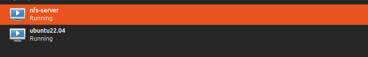
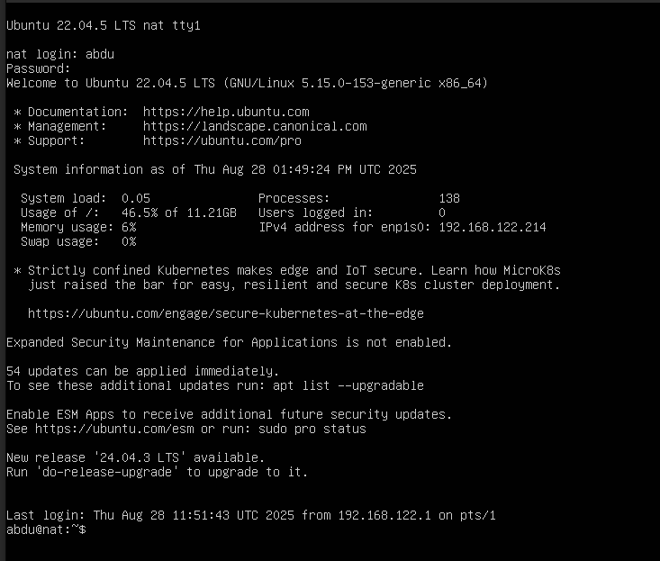
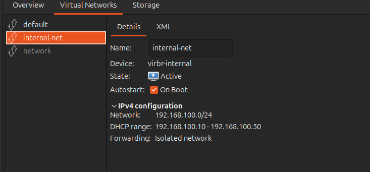
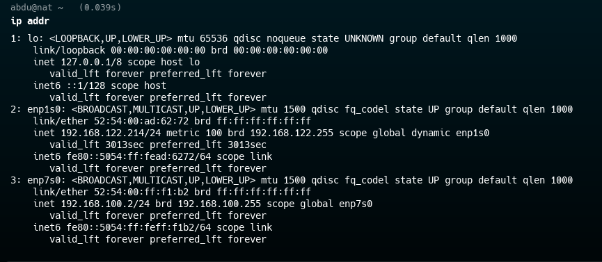
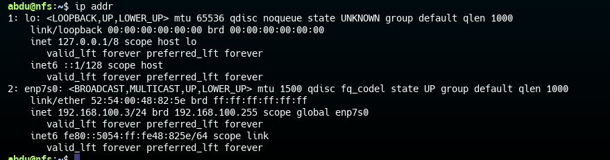
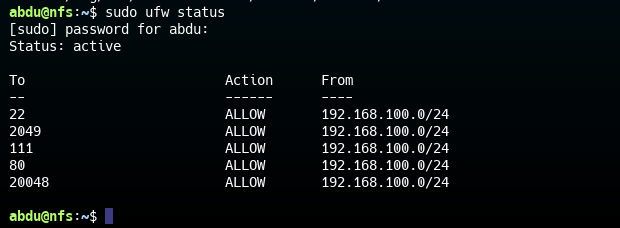
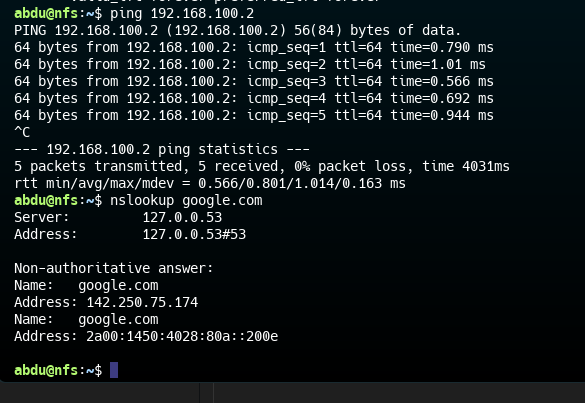
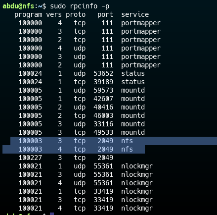

# NAT Router with NFS-Backed Web Server Project

## Project Overview

This project demonstrates a multi-VM infrastructure using KVM hypervisor where:
- **VM1 (nat)** acts as a NAT router and web server
- **VM2 (nfs)** serves as a dedicated NFS storage server
- Nginx on VM1 serves content from an NFS mount pointing to VM2
- All traffic flows through VM1, which provides NAT functionality for VM2

## Architecture Diagram

```
[Internet]
    |
[Host Machine]
    |
[KVM Hypervisor]
    |\
    | [VM1 - nat] (192.168.122.214) 
    | |    |
    | |    +-- enp1s0: External NIC (default network)
    | |    +-- enp7s0: Internal NIC (192.168.100.2)
    | |    |
    | |    +-- Nginx (serving from /mnt/nfs/html)
    | |    +-- NAT Router (iptables)
    | |
    | [VM2 - nfs] (192.168.100.3)
    |     |
    |     +-- enp7s0: Internal NIC only
    |     |
    |     +-- NFS Server (/var/www/html)
    |     +-- Firewall (UFW)
```

## Prerequisites

- KVM/QEMU installed on host machine
- Ubuntu Server VMs (vm1-nat and vm2-nfs)
- Internal network created in KVM (`internal-net`)

## Setup Process

### 1. Initial VM Configuration



The initial setup showing the VM configuration process in KVM.

### 2. Network Configuration Setup


Network interface configuration for both VMs showing the internal network setup.

### 3. VM1 Network Interface Configuration


Configuration of VM1 with both external and internal network interfaces.

### 4. VM2 Network Configuration  

.png)

VM2 configured with only internal network interface for security isolation.


## Network Configuration Details

### Internal Network Setup
```bash
# Create internal network XML
cat > internal-net.xml << EOF
<network>
  <name>internal-net</name>
  <bridge name="virbr-int"/>
  <ip address="192.168.100.1" netmask="255.255.255.0">
    <dhcp>
      <range start="192.168.100.100" end="192.168.100.200"/>
    </dhcp>
  </ip>
</network>
EOF

# Define and start network
sudo virsh net-define internal-net.xml
sudo virsh net-start internal-net
sudo virsh net-autostart internal-net
```

### VM Network Interfaces
- **VM1 (nat)**: `enp1s0` (external), `enp7s0` (internal)
- **VM2 (nfs)**: `enp7s0` (internal only)

## VM1 (nat) Configuration

### Network Setup
```bash
network:
  version: 2
  renderer: networkd
  ethernets:
    enp1s0:
      dhcp4: true
    enp7s0:
      dhcp4: no
      addresses: [192.168.100.2/24]
```


### NAT Routing Configuration

![NAT Configuration Process]

```bash
# Enable IP forwarding
echo "net.ipv4.ip_forward=1" | sudo tee -a /etc/sysctl.conf
sudo sysctl -p

# Configure iptables NAT
sudo iptables -t nat -A POSTROUTING -o enp1s0 -j MASQUERADE
sudo iptables -A FORWARD -i enp7s0 -o enp1s0 -j ACCEPT
sudo iptables -A FORWARD -i enp1s0 -o enp7s0 -m state --state RELATED,ESTABLISHED -j ACCEPT

# Save iptables rules
sudo apt install iptables-persistent -y
```

### NFS Client Setup


```bash
# Install NFS client
sudo apt install nfs-common -y

# Create mount point
sudo mkdir -p /mnt/nfs/html

# Manual mount
sudo mount 192.168.100.3:/var/www/html /mnt/nfs/html

# Permanent mount (/etc/fstab)
192.168.100.3:/var/www/html /mnt/nfs/html nfs defaults,_netdev 0 0
```

.png)


### Nginx Configuration


```bash
# Install Nginx
sudo apt install nginx -y

# Configure Nginx to serve from NFS mount
sudo nano /etc/nginx/sites-available/default
```
Modified root directive:
```nginx
root /mnt/nfs/html;
```
.png)
.png)


## VM2 (nfs) Configuration

### Network Setup

![VM2 Network Configuration]

```bash
# /etc/netplan/01-netcfg.yaml
network:
  version: 2
  renderer: networkd
  ethernets:
    enp7s0:
      dhcp4: no
      addresses: [192.168.100.3/24]
      routes:
        - to: default
          via: 192.168.100.2
      nameservers:
        addresses: [8.8.8.8, 1.1.1.1]
```

### NFS Server Setup


```bash
# Install NFS server and Nginx
sudo apt install nfs-kernel-server nginx -y

# Configure NFS exports (/etc/exports)
/var/www/html 192.168.100.2(rw,sync,no_subtree_check,no_root_squash)


### Firewall Configuration

.png)

```bash
# Configure UFW for NFS
sudo ufw allow from 192.168.100.0/24 to any port 22
sudo ufw allow from 192.168.100.0/24 to any port 2049
sudo ufw allow from 192.168.100.0/24 to any port 111
sudo ufw allow from 192.168.100.0/24 to any port 20048
sudo ufw enable
```


## Verification and Testing

### Network Connectivity Testing

.png)

```bash
# From VM2, ping VM1
ping 192.168.100.2

# From VM2, test internet through NAT
ping 8.8.8.8


```


### Final Validation and Web Server Access

.png)

The final verification showing the successful access to the Nginx web server on VM1, which is serving content from the NFS share hosted on VM2.

### NFS Mount Verification
```bash
# Check mount point
df -hT | grep nfs


# List NFS share contents
ls -la /mnt/nfs/html/
```
.png)

### Nginx Service Verification
```bash
# Test Nginx configuration
sudo nginx -t

# Check Nginx status
sudo systemctl status nginx

# Local curl test
curl localhost
```


### Final Validation Steps
1. Find VM1's external IP: `ip a show dev enp1s0`
2. Access in browser: `http://192.168.122.214`
3. Verify content is served from VM2's NFS share

## Key Features Demonstrated

1. **Network Isolation**: VM2 has no direct internet access
2. **NAT Routing**: VM1 provides internet access to VM2
3. **NFS File Sharing**: Centralized content storage
4. **Firewall Security**: Minimal ports open, network segmentation
5. **Service Integration**: Nginx serving content from remote NFS

## Implementation Summary

This project successfully demonstrates:

- **KVM Hypervisor**: Used for creating and managing virtual machines
- **Network Segmentation**: Internal network isolation with controlled access
- **NAT Functionality**: VM1 acting as gateway for VM2
- **NFS Integration**: Centralized file storage and sharing
- **Web Server Configuration**: Nginx serving content from remote NFS mount
- **Security Implementation**: Firewall rules and network access controls

## Troubleshooting

### Common Issues and Solutions

1. **NFS Mount Hanging**: Check firewall rules and NFS service ports
2. **No Internet on VM2**: Verify NAT rules on VM1
3. **Connection Timeouts**: Confirm proper network configuration
4. **Permission Issues**: Ensure `no_root_squash` in exports

### Diagnostic Commands
```bash
# Check NFS services
sudo rpcinfo -p

# Verify exports
sudo exportfs -v


# Check firewall status
sudo ufw status numbered

# Verify network interfaces
ip addr show

# Check routing table
ip route show

# Test DNS resolution
nslookup google.com
```

## Security Considerations

- VM2 is isolated from external networks
- Only necessary ports are open on both VMs
- NFS export is restricted to specific IP (192.168.100.2)
- Regular security updates should be applied
- Network traffic flows through controlled NAT gateway
- Firewall rules implement principle of least privilege


## Conclusion

This implementation provides a secure, scalable infrastructure pattern using KVM hypervisor that demonstrates enterprise-level networking concepts including NAT routing, NFS file sharing, and network segmentation. The setup can be extended for more complex deployments and serves as a foundation for understanding virtualized network architectures.

The project successfully shows how to:
- Create isolated network segments
- Implement NAT routing for controlled internet access
- Set up centralized file storage with NFS
- Configure web services with remote content
- Implement proper security controls

This architecture pattern is commonly used in enterprise environments for creating secure, manageable infrastructure with clear separation of concerns between networking, storage, and application services.
